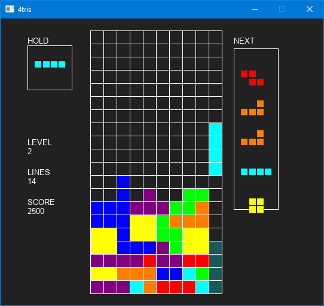
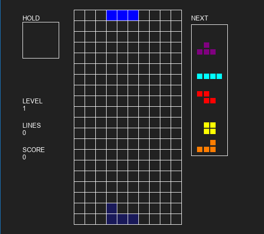

# T-Engine
## A C/C++ Tetris engine

A C Tetris engine (2009 Tetris Guideline compliant-ish).
Bring your own input handling and rendering. See [Examples](#example-implementation).

Not 100% complete but deciding to open source it.

## Features

- [x] I, O, T, S, Z, J, L pieces
- [x] Super Rotation System (SRS) (implementation variation but result still the same)
- [x] Random Generator ("random bag" or "7-system")
- [x] Ghost piece
- [x] "Hold piece"
- [x] Top out on overlapping spawn or partial lock out of bounds
- [x] Level up conditions
- [x] Scoring
- [x] Gravity
  - [x] Naive (most games use this i.e. clear at most 4 lines at once)
  - [ ] ~~Sticky~~
  - [ ] ~~Cascade~~
- [x] Lock Delay

## TODO

- [ ] **CLEAN UP CODE/DOCUMENTATION/Better implementation of some things**
- [ ] T-spin condition check
- [ ] Combos/Back-to-back
- [ ] Use a configuration struct to pass into `te_init_system()`
- [ ] Delay Auto Shift (DAS)
- [ ] Time-based update function (currently frame based)

## Data Structures

## API

```c
// Movement
void move_left();
void move_right();
void move_down();
void hard_drop();
void rotate_left();
void rotate_right();

// System
void te_init_system();
TState *get_state();
Board *get_board();
Piece get_current_piece();
Piece get_next_piece();
PieceType *te_get_next_piece_buf();
PieceOffsets get_piece_offsets(PieceType type, PieceOrientation orientation);
void hold(); // Holds the current piece and swaps to held
void get_ghost(); // Get the location of the current piece if hard dropped
void commit(); // Commits piece to board
void te_update(int d_frame); // Updates the state of the game
int te_is_game_over(); // Is the game over?
int te_get_level(); // Get the current level
int te_get_score(); // Get the current score

// For debugging
void load_board(int data[220]);
Board *get_committed_board();
```

## Example Implementation

Rough implementation with C++/SDL2/SDL2_ttf compiled using MSVC. Yes, I know the UI sucks.



## Resources

[Tetris Guidelines](https://tetris.wiki/Tetris_Guideline)

[Super Rotation System (SRS)](http://harddrop.com/wiki/SRS)

[T-Spin](http://harddrop.com/wiki/T-Spin)

[Line Clear](https://tetris.wiki/Line_clear)

[Combo](http://harddrop.com/wiki/Combo)

[Random Generator](http://harddrop.com/wiki/Random_Generator)

[Gravity Curve](https://harddrop.com/wiki/Tetris_Worlds)

[How Tetris 99 Gravity Works](https://old.reddit.com/r/Tetris99/comments/c03g2i/how_tetris_99_gravity_works)


## License

MIT License

Copyright (c) [2019] [Raymond Wan]

Permission is hereby granted, free of charge, to any person obtaining a copy
of this software and associated documentation files (the "Software"), to deal
in the Software without restriction, including without limitation the rights
to use, copy, modify, merge, publish, distribute, sublicense, and/or sell
copies of the Software, and to permit persons to whom the Software is
furnished to do so, subject to the following conditions:

The above copyright notice and this permission notice shall be included in all
copies or substantial portions of the Software.

THE SOFTWARE IS PROVIDED "AS IS", WITHOUT WARRANTY OF ANY KIND, EXPRESS OR
IMPLIED, INCLUDING BUT NOT LIMITED TO THE WARRANTIES OF MERCHANTABILITY,
FITNESS FOR A PARTICULAR PURPOSE AND NONINFRINGEMENT. IN NO EVENT SHALL THE
AUTHORS OR COPYRIGHT HOLDERS BE LIABLE FOR ANY CLAIM, DAMAGES OR OTHER
LIABILITY, WHETHER IN AN ACTION OF CONTRACT, TORT OR OTHERWISE, ARISING FROM,
OUT OF OR IN CONNECTION WITH THE SOFTWARE OR THE USE OR OTHER DEALINGS IN THE
SOFTWARE.
